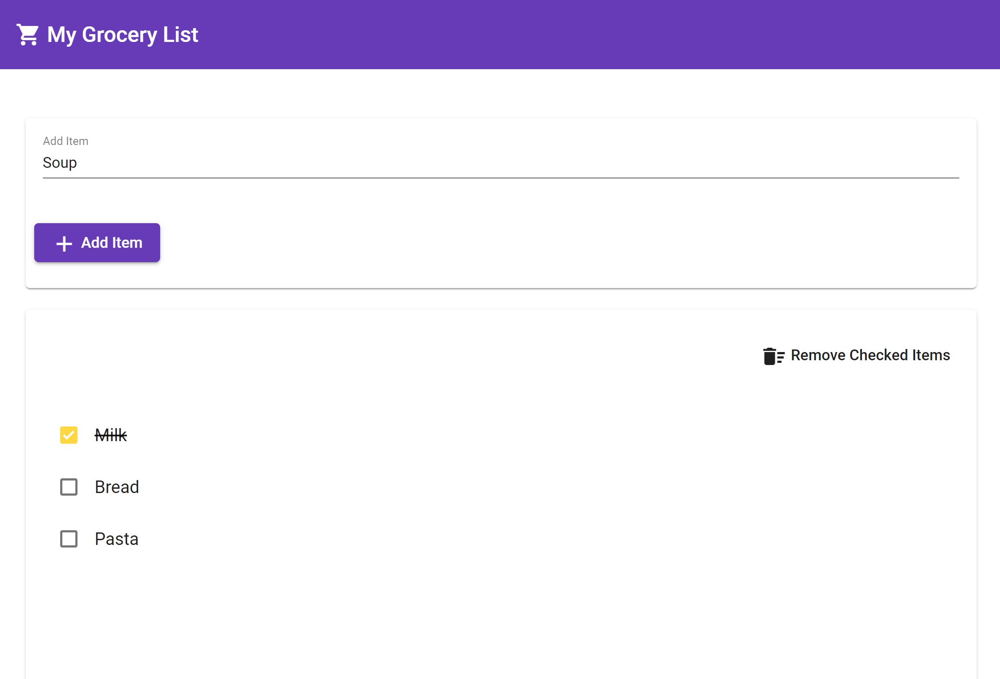

# Grocery Shopping List App

## Summary

This is a shopping list web application. Users can view, add, delete and cross items off their shopping list.

## Frontend

An Angular project.

For more details, please review the readme file in the [`client/` directory](client/README.md).

## Backend

A .NET API project.

For more details, please review the readme file in the [`server/` directory](server/README.md).

## Goals of Project

- Does it work?
- Were instructions followed?
- Is the code clean and well-crafted?
- Are standard best practices being followed?
- Are project files well-organized?

## Running the projects

To run the applications:

- In one terminal (or Visual Studio 2022), follow the directions in the [`server/` directory](server/README.md#running-the-project).
- In another terminal, follow the directions in the [`client/` directory](client/README.md#running-the-project).
